# 1. Summary:

[Kellen will insert once we have the full results]  


# 2. Descriptive plots and descriptive statistics

## 2.1 DEEP histograms

### 2.1.1 Beta and Delta using Qi's method


```r
ggplot(f16, aes(x=hierbeta)) + 
  geom_density()
```

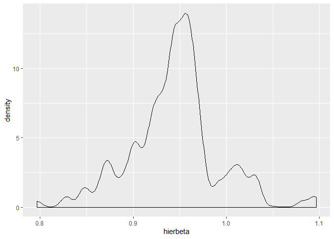<!-- -->

```r
ggplot(f16, aes(x=hierdelta)) + 
  geom_density()
```

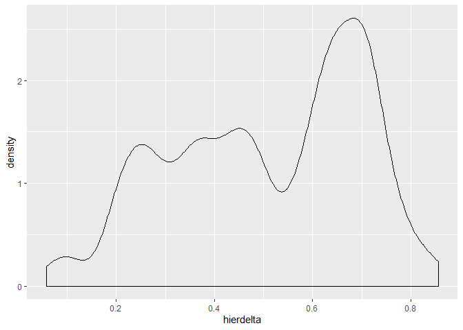<!-- -->


### 2.1.2 Beta and Delta using Dan's method


```r
ggplot(f16, aes(x=beta)) + 
  geom_density()
```

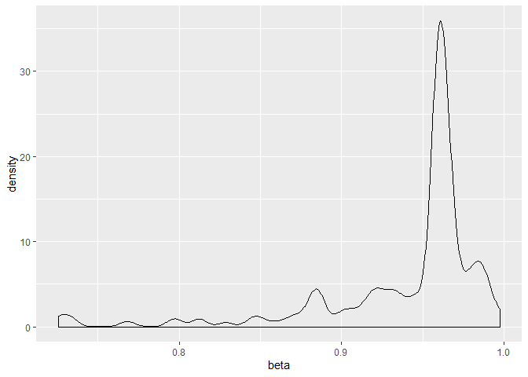<!-- -->

```r
ggplot(f16, aes(x=annualfactor)) + 
  geom_density()
```

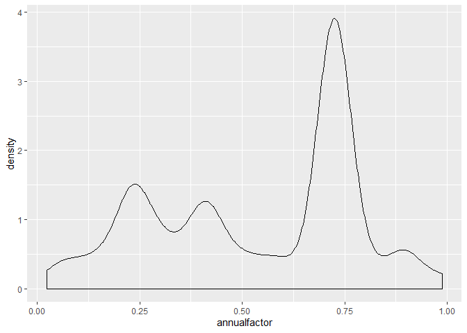<!-- -->

```r
#correlations are lower (better) using Dan's method.
cor(f16$beta, f16$annualfactor)
```

```
## [1] 0.2875686
```

```r
cor(f16$hierbeta, f16$hierdelta)
```

```
## [1] 0.2247541
```


## 2.2 Search histograms displaying skewness and reasons for using sqrt transformation

The rule I've been taught for skewness (which I also pre-registered, at least for CCP1) is if skewness is between -1 and +1, the variable can be left as is. If it is outside those, run a transformation to get it within those boundaries and as close to 0 as possible. Log-transformation results in a negative skew, which in CCP1 was less than -1 and is worse than the sqrt transformation in every study; square-root transformation does better (see stats below)


```r
skewness(f16$numopened,na.rm=TRUE)
```

```
## [1] 1.89254
```

```r
skewness(f16$sqrtnumopened,na.rm=TRUE)
```

```
## [1] 0.7685263
```

```r
skewness(f16$lognumopened,na.rm=TRUE)
```

```
## [1] -0.1377331
```

```r
hist(f16$numopened,main="Untransformed Boxes Opened",xlab="Boxes Opened (untransformed)",yaxt='n')
```

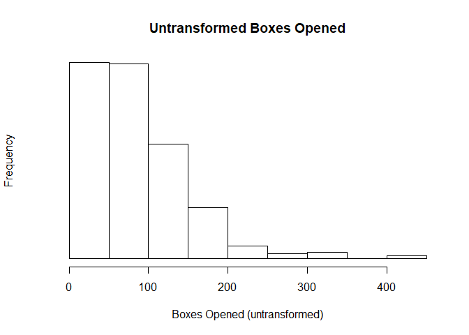<!-- -->

```r
summary(cc$numopened)
```

```
##    Min. 1st Qu.  Median    Mean 3rd Qu.    Max.    NA's 
##       2      71     116     132     168     448       7
```

```r
hist(f16$sqrtnumopened,main="Sqrt Transformation",xlab="Sqrt boxes opened",yaxt='n')
```

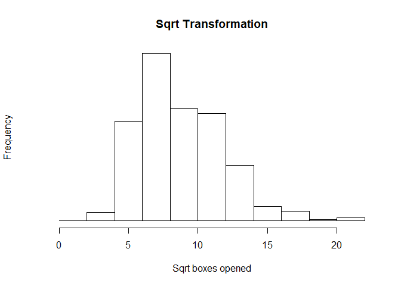<!-- -->

```r
summary(f16$sqrtnumopened)
```

```
##    Min. 1st Qu.  Median    Mean 3rd Qu.    Max. 
##   1.414   6.403   8.367   8.782  10.909  21.166
```

```r
hist(f16$lognumopened,main="Log Transformation",xlab="Log boxes opened",yaxt='n')
```

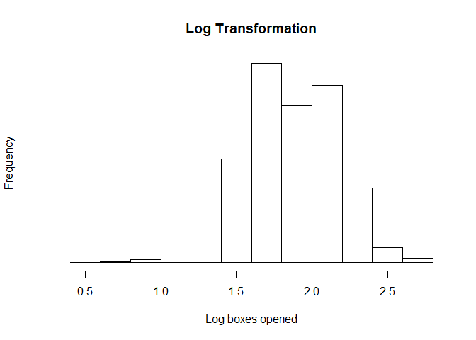<!-- -->

```r
summary(f16$lognumopened)
```

```
##    Min. 1st Qu.  Median    Mean 3rd Qu.    Max. 
##  0.4771  1.6232  1.8513  1.8403  2.0792  2.6522
```


## 2.4 Choice accuracy overall


```r
summary(f16$correct)
```

```
##    Min. 1st Qu.  Median    Mean 3rd Qu.    Max. 
##  0.0000  0.0000  1.0000  0.5036  1.0000  1.0000
```


## 2.5 Descriptives of the new box openings measure. 

**Fixations** is the number of times a given box was opened. 16 lines per participant, corresponding to the 16 boxes in the mlweb display.

Note. In this new format, skewness is actually best (lowest) for the log-transformation (3rd histogram and 3rd number in the skewness summary statistics below)


```r
skewness(f16$fixations,na.rm=TRUE)
```

```
## [1] 2.963282
```

```r
f16$sqrtfixations<-sqrt(f16$fixations)
skewness(f16$sqrtfixations,na.rm=TRUE)
```

```
## [1] 1.129933
```

```r
f16$logfixations<-log10(f16$fixations+1)
skewness(f16$logfixations,na.rm=TRUE)
```

```
## [1] 0.4005703
```

```r
hist(f16$numopened,main="Untransformed Boxes Opened",xlab="Boxes Opened (untransformed)")
```

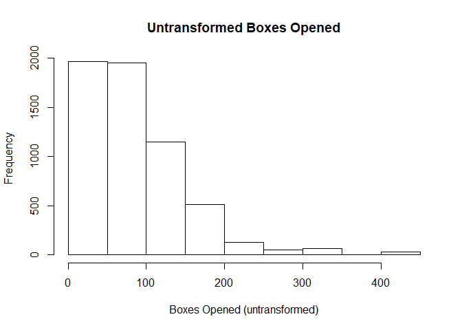<!-- -->

```r
hist(f16$sqrtnumopened,main="Sqrt Transformation",xlab="Sqrt boxes opened")
```

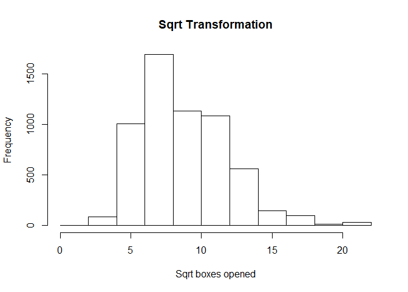<!-- -->

```r
hist(f16$lognumopened,main="Log Transformation",xlab="Log boxes opened")
```

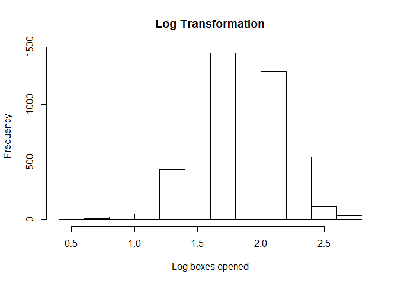<!-- -->

```r
summary(f16$fixations)
```

```
##    Min. 1st Qu.  Median    Mean 3rd Qu.    Max. 
##   1.000   2.000   4.000   5.421   7.000  65.000
```

## 2.4 Search time (with and without outliers excluded)

Outliers get in the way of nice distributions, as is apparent below.  


```r
# Time spent searching per trial (raw count)
hist(f16$searchtime, xlab="Search time (untransformed w/outliers)",yaxt='n')
```

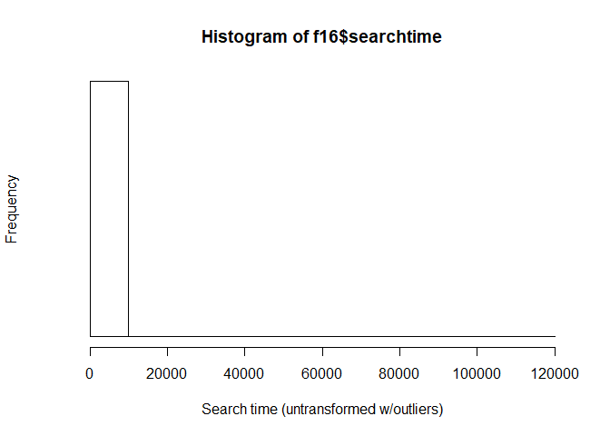<!-- -->

```r
summary(f16$searchtime)
```

```
##      Min.   1st Qu.    Median      Mean   3rd Qu.      Max. 
##      3.69     59.75    138.74    552.21    273.76 118545.28
```

```r
# Time spent searching per trial (transformed to reduce skewness, outliers included)
hist(f16$sqrttime, xlab="Sqrt search time w/outliers",yaxt='n')
```

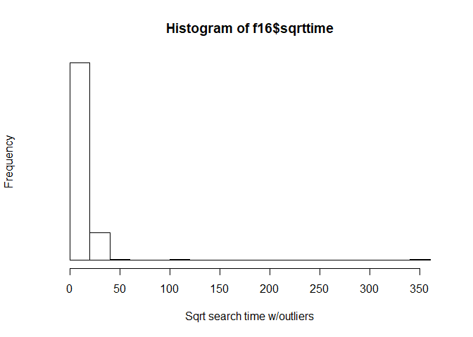<!-- -->

```r
summary(f16$sqrttime)
```

```
##    Min. 1st Qu.  Median    Mean 3rd Qu.    Max. 
##   1.922   7.730  11.779  13.824  16.546 344.304
```

```r
# Log transformed searchtime (outliers included)
hist(f16$logtime, xlab = "Log search time w/outliers", yaxt = 'n')
```

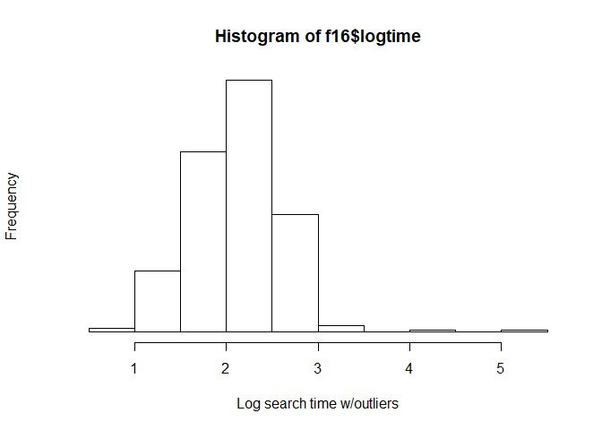<!-- -->

```r
summary(f16$logtime)
```

```
##    Min. 1st Qu.  Median    Mean 3rd Qu.    Max. 
##  0.6715  1.7835  2.1453  2.1161  2.4390  5.0739
```

```r
## Exclude search time outliers
f16nooutliers<-f16[!(f16$searchtime>300), ]

# Time spent searching per trial (raw count)
hist(f16nooutliers$searchtime, xlab="Search time (untransformed)",yaxt='n')
```

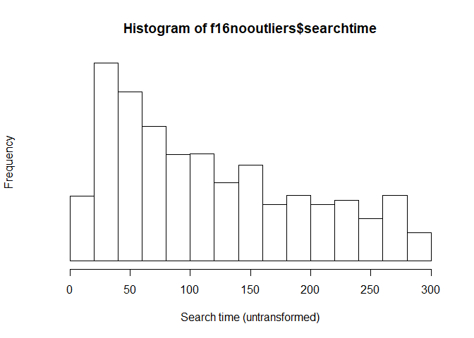<!-- -->

```r
summary(f16nooutliers$searchtime)
```

```
##    Min. 1st Qu.  Median    Mean 3rd Qu.    Max. 
##   3.693  48.738  97.763 116.520 177.430 297.764
```

```r
# Time spent searching per trial (transformed to reduce skewness)
hist(f16nooutliers$sqrttime, xlab="Sqrt search time",yaxt='n')
```

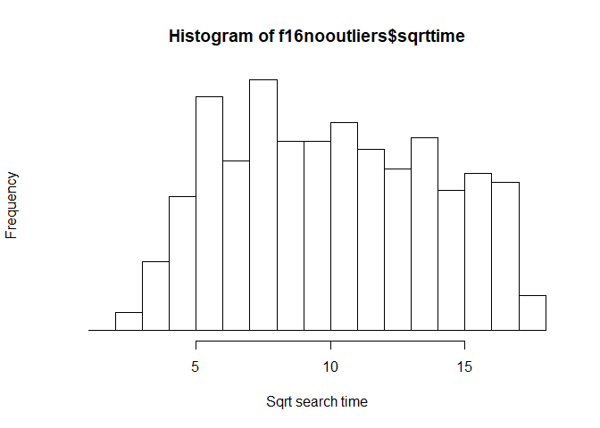<!-- -->

```r
summary(f16nooutliers$sqrttime)
```

```
##    Min. 1st Qu.  Median    Mean 3rd Qu.    Max. 
##   1.922   6.981   9.888  10.102  13.320  17.256
```

```r
# Log transformed searchtime
hist(f16nooutliers$logtime, xlab = "Log search time", yaxt = 'n')
```

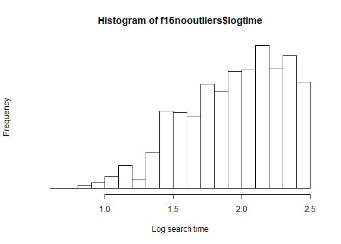<!-- -->

```r
summary(f16nooutliers$logtime)
```

```
##    Min. 1st Qu.  Median    Mean 3rd Qu.    Max. 
##  0.6715  1.6967  1.9946  1.9455  2.2515  2.4753
```


# 3. New Inferential Analyses

## 3.1. Model below predicts number of fixations on a box from attribute of the box, beta, delta, and interactions with beta and delta. 

Note. It now converges even with this complex model, thanks to the optimizer... line of code.

Results: Main effects of beta and standard rate (i.e., people with low present bias search more, and people look more at the standard rate boxes than the other boxes). No significant interactions, although there is a slight tendency for people with higher delta (i.e., those who discount less look more at the "period" attribute) <-- is all this true? - Nate 


```r
f16$attbox<-as.factor(f16$attbox)

m6a<-glmer(fixations~hierbeta.c+hierdelta.c+(1|ipaddress),data=f16,family=poisson,control=glmerControl(optimizer="bobyqa",optCtrl=list(maxfun=2e5)))
summary(m6a)
```

```
## Generalized linear mixed model fit by maximum likelihood (Laplace
##   Approximation) [glmerMod]
##  Family: poisson  ( log )
## Formula: fixations ~ hierbeta.c + hierdelta.c + (1 | ipaddress)
##    Data: f16
## Control: 
## glmerControl(optimizer = "bobyqa", optCtrl = list(maxfun = 2e+05))
## 
##      AIC      BIC   logLik deviance df.resid 
##  29803.5  29830.2 -14897.7  29795.5     5842 
## 
## Scaled residuals: 
##     Min      1Q  Median      3Q     Max 
## -4.0827 -0.8541 -0.2420  0.6362 14.9652 
## 
## Random effects:
##  Groups    Name        Variance Std.Dev.
##  ipaddress (Intercept) 0.375    0.6124  
## Number of obs: 5846, groups:  ipaddress, 182
## 
## Fixed effects:
##             Estimate Std. Error z value Pr(>|z|)    
## (Intercept)  1.48468    0.04599  32.286   <2e-16 ***
## hierbeta.c   0.63520    0.98999   0.642    0.521    
## hierdelta.c  0.24167    0.24429   0.989    0.323    
## ---
## Signif. codes:  0 '***' 0.001 '**' 0.01 '*' 0.05 '.' 0.1 ' ' 1
## 
## Correlation of Fixed Effects:
##             (Intr) hrbt.c
## hierbeta.c   0.012       
## hierdelta.c  0.024 -0.210
```

```r
m6t <- glmer(fixations~hierbeta.c*attbox + hierdelta.c*attbox + (1|ipaddress), data=f16,family=poisson, control=glmerControl(optimizer="bobyqa" , optCtrl=list(maxfun=2e5)))
summary(m6t) 
```

```
## Generalized linear mixed model fit by maximum likelihood (Laplace
##   Approximation) [glmerMod]
##  Family: poisson  ( log )
## Formula: fixations ~ hierbeta.c * attbox + hierdelta.c * attbox + (1 |  
##     ipaddress)
##    Data: f16
## Control: 
## glmerControl(optimizer = "bobyqa", optCtrl = list(maxfun = 2e+05))
## 
##      AIC      BIC   logLik deviance df.resid 
##  28742.4  28829.1 -14358.2  28716.4     5833 
## 
## Scaled residuals: 
##     Min      1Q  Median      3Q     Max 
## -3.6007 -0.8209 -0.2114  0.6383 12.4622 
## 
## Random effects:
##  Groups    Name        Variance Std.Dev.
##  ipaddress (Intercept) 0.3754   0.6127  
## Number of obs: 5846, groups:  ipaddress, 182
## 
## Fixed effects:
##                                 Estimate Std. Error z value Pr(>|z|)    
## (Intercept)                     1.197861   0.047488  25.224  < 2e-16 ***
## hierbeta.c                     -0.087958   1.030185  -0.085  0.93196    
## attboxAPR                       0.521606   0.016414  31.778  < 2e-16 ***
## attboxIntro Period              0.311189   0.017104  18.194  < 2e-16 ***
## attboxIntro Rate                0.242234   0.017339  13.971  < 2e-16 ***
## hierdelta.c                     0.248227   0.253145   0.981  0.32680    
## hierbeta.c:attboxAPR            1.011446   0.364858   2.772  0.00557 ** 
## hierbeta.c:attboxIntro Period   0.677539   0.379848   1.784  0.07447 .  
## hierbeta.c:attboxIntro Rate     0.914054   0.385586   2.371  0.01776 *  
## attboxAPR:hierdelta.c          -0.006568   0.090566  -0.073  0.94219    
## attboxIntro Period:hierdelta.c  0.029219   0.094532   0.309  0.75725    
## attboxIntro Rate:hierdelta.c   -0.040326   0.095743  -0.421  0.67362    
## ---
## Signif. codes:  0 '***' 0.001 '**' 0.01 '*' 0.05 '.' 0.1 ' ' 1
## 
## Correlation of Fixed Effects:
##             (Intr) hrbt.c attAPR attbIP attbIR hrdlt. h.:APR hr.:IP hr.:IR
## hierbeta.c   0.013                                                        
## attboxAPR   -0.218 -0.003                                                 
## attbxIntrPr -0.209 -0.003  0.604                                          
## attbxIntrRt -0.207 -0.002  0.596  0.572                                   
## hierdelta.c  0.020 -0.215  0.008  0.008  0.008                            
## hrbt.c:tAPR -0.003 -0.221 -0.004  0.008  0.008  0.061                     
## hrbt.c:ttIP -0.003 -0.212  0.008  0.000  0.008  0.059  0.603              
## hrbt.c:ttIR -0.002 -0.210  0.008  0.008 -0.004  0.058  0.594  0.571       
## attbxAPR:h.  0.008  0.061 -0.034 -0.022 -0.022 -0.226 -0.275 -0.165 -0.163
## attbxIPrd:.  0.007  0.058 -0.022 -0.036 -0.021 -0.216 -0.165 -0.277 -0.156
## attbxIRt:h.  0.008  0.058 -0.022 -0.021 -0.030 -0.214 -0.163 -0.157 -0.277
##             aAPR:. atIP:.
## hierbeta.c               
## attboxAPR                
## attbxIntrPr              
## attbxIntrRt              
## hierdelta.c              
## hrbt.c:tAPR              
## hrbt.c:ttIP              
## hrbt.c:ttIR              
## attbxAPR:h.              
## attbxIPrd:.  0.604       
## attbxIRt:h.  0.597  0.572
```


## 3.2 Plot of the relationship between beta and fixations for each of the four attributes.


```r
m7<-glmer(fixations~hierbeta.c*attbox+(1|ipaddress),data=f16,family=poisson,control=glmerControl(optimizer="bobyqa",optCtrl=list(maxfun=2e5)))
summary(m7)
```

```
## Generalized linear mixed model fit by maximum likelihood (Laplace
##   Approximation) [glmerMod]
##  Family: poisson  ( log )
## Formula: fixations ~ hierbeta.c * attbox + (1 | ipaddress)
##    Data: f16
## Control: 
## glmerControl(optimizer = "bobyqa", optCtrl = list(maxfun = 2e+05))
## 
##      AIC      BIC   logLik deviance df.resid 
##  28736.0  28796.1 -14359.0  28718.0     5837 
## 
## Scaled residuals: 
##     Min      1Q  Median      3Q     Max 
## -3.6009 -0.8220 -0.2109  0.6408 12.4613 
## 
## Random effects:
##  Groups    Name        Variance Std.Dev.
##  ipaddress (Intercept) 0.3774   0.6143  
## Number of obs: 5846, groups:  ipaddress, 182
## 
## Fixed effects:
##                               Estimate Std. Error z value Pr(>|z|)    
## (Intercept)                    1.19676    0.04759  25.148  < 2e-16 ***
## hierbeta.c                     0.12724    1.00685   0.126  0.89944    
## attboxAPR                      0.52156    0.01640  31.794  < 2e-16 ***
## attboxIntro Period             0.31136    0.01709  18.215  < 2e-16 ***
## attboxIntro Rate               0.24204    0.01733  13.966  < 2e-16 ***
## hierbeta.c:attboxAPR           1.00427    0.35096   2.861  0.00422 ** 
## hierbeta.c:attboxIntro Period  0.71089    0.36526   1.946  0.05162 .  
## hierbeta.c:attboxIntro Rate    0.86865    0.37053   2.344  0.01906 *  
## ---
## Signif. codes:  0 '***' 0.001 '**' 0.01 '*' 0.05 '.' 0.1 ' ' 1
## 
## Correlation of Fixed Effects:
##             (Intr) hrbt.c attAPR attbIP attbIR h.:APR hr.:IP
## hierbeta.c   0.017                                          
## attboxAPR   -0.217 -0.001                                   
## attbxIntrPr -0.208 -0.001  0.604                            
## attbxIntrRt -0.206  0.000  0.596  0.572                     
## hrbt.c:tAPR -0.001 -0.218 -0.014  0.002  0.002              
## hrbt.c:ttIP  0.000 -0.209  0.002 -0.010  0.002  0.604       
## hrbt.c:ttIR  0.000 -0.207  0.002  0.002 -0.012  0.595  0.572
```

```r
plot(Effect(c("hierbeta.c", "attbox"), m7))
```

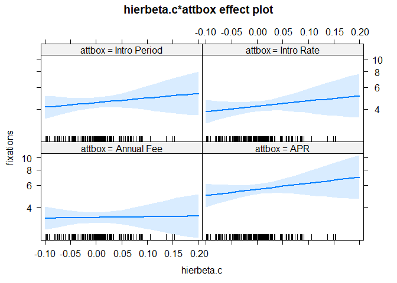<!-- -->


## 3.3 Plot of the relationship between delta and fixations for each of the four attributes.


```r
m8<-glmer(fixations~hierdelta.c*attbox+(1|ipaddress),data=f16,family=poisson,control=glmerControl(optimizer="bobyqa",optCtrl=list(maxfun=2e5)))
summary(m8)
```

```
## Generalized linear mixed model fit by maximum likelihood (Laplace
##   Approximation) [glmerMod]
##  Family: poisson  ( log )
## Formula: fixations ~ hierdelta.c * attbox + (1 | ipaddress)
##    Data: f16
## Control: 
## glmerControl(optimizer = "bobyqa", optCtrl = list(maxfun = 2e+05))
## 
##      AIC      BIC   logLik deviance df.resid 
##  28743.2  28803.3 -14362.6  28725.2     5837 
## 
## Scaled residuals: 
##     Min      1Q  Median      3Q     Max 
## -3.6011 -0.8225 -0.2121  0.6346 12.4604 
## 
## Random effects:
##  Groups    Name        Variance Std.Dev.
##  ipaddress (Intercept) 0.3762   0.6134  
## Number of obs: 5846, groups:  ipaddress, 182
## 
## Fixed effects:
##                                Estimate Std. Error z value Pr(>|z|)    
## (Intercept)                     1.19740    0.04753  25.190   <2e-16 ***
## hierdelta.c                     0.23162    0.24730   0.937    0.349    
## attboxAPR                       0.52206    0.01641  31.814   <2e-16 ***
## attboxIntro Period              0.31124    0.01710  18.199   <2e-16 ***
## attboxIntro Rate                0.24251    0.01734  13.989   <2e-16 ***
## hierdelta.c:attboxAPR           0.06279    0.08690   0.723    0.470    
## hierdelta.c:attboxIntro Period  0.07576    0.09061   0.836    0.403    
## hierdelta.c:attboxIntro Rate    0.02264    0.09183   0.247    0.805    
## ---
## Signif. codes:  0 '***' 0.001 '**' 0.01 '*' 0.05 '.' 0.1 ' ' 1
## 
## Correlation of Fixed Effects:
##             (Intr) hrdlt. attAPR attbIP attbIR h.:APR hr.:IP
## hierdelta.c  0.023                                          
## attboxAPR   -0.218  0.008                                   
## attbxIntrPr -0.209  0.007  0.604                            
## attbxIntrRt -0.206  0.007  0.596  0.572                     
## hrdlt.c:APR  0.007 -0.221 -0.037 -0.020 -0.020              
## hrdlt.c:tIP  0.007 -0.212 -0.020 -0.037 -0.019  0.603       
## hrdlt.c:tIR  0.007 -0.209 -0.020 -0.019 -0.032  0.595  0.571
```

```r
plot(Effect(c("hierdelta.c", "attbox"), m8))
```

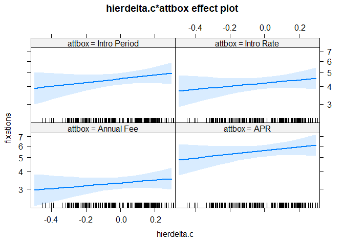<!-- -->


### 3.3.1 Do we want to do logfixations too? Can't use poisson for that 


```r
m11l<-lmer(logfixations~hierbeta.c+hierdelta.c+(1|ipaddress),data=f16)
summary(m11l)
```

```
## Linear mixed model fit by REML. t-tests use Satterthwaite's method [
## lmerModLmerTest]
## Formula: logfixations ~ hierbeta.c + hierdelta.c + (1 | ipaddress)
##    Data: f16
## 
## REML criterion at convergence: -1388.5
## 
## Scaled residuals: 
##     Min      1Q  Median      3Q     Max 
## -3.2839 -0.6600 -0.0013  0.6608  4.2077 
## 
## Random effects:
##  Groups    Name        Variance Std.Dev.
##  ipaddress (Intercept) 0.04179  0.2044  
##  Residual              0.04137  0.2034  
## Number of obs: 5846, groups:  ipaddress, 182
## 
## Fixed effects:
##              Estimate Std. Error        df t value Pr(>|t|)    
## (Intercept)   0.70056    0.01541 178.42694  45.468   <2e-16 ***
## hierbeta.c    0.20228    0.33456 180.20359   0.605    0.546    
## hierdelta.c   0.06642    0.08193 179.15538   0.811    0.419    
## ---
## Signif. codes:  0 '***' 0.001 '**' 0.01 '*' 0.05 '.' 0.1 ' ' 1
## 
## Correlation of Fixed Effects:
##             (Intr) hrbt.c
## hierbeta.c   0.013       
## hierdelta.c  0.025 -0.210
```


## 3.4 Beta and delta prediction of accuracy (logit model)

```r
# logit mixed effects model, no controls
m10 <- glmer(correct~hierbeta.c + hierdelta.c + (1|ipaddress), family = binomial(link = "logit"), data = f16) 
# Note: new_beta and new_delta are same as hierbeta and hierdelta
summary(m10)
```

```
## Generalized linear mixed model fit by maximum likelihood (Laplace
##   Approximation) [glmerMod]
##  Family: binomial  ( logit )
## Formula: correct ~ hierbeta.c + hierdelta.c + (1 | ipaddress)
##    Data: f16
## 
##      AIC      BIC   logLik deviance df.resid 
##   4106.2   4132.9  -2049.1   4098.2     5842 
## 
## Scaled residuals: 
##     Min      1Q  Median      3Q     Max 
## -1.8500 -0.0796  0.0501  0.0807  3.2365 
## 
## Random effects:
##  Groups    Name        Variance Std.Dev.
##  ipaddress (Intercept) 32.77    5.724   
## Number of obs: 5846, groups:  ipaddress, 182
## 
## Fixed effects:
##             Estimate Std. Error z value Pr(>|z|)  
## (Intercept) -0.01632    0.49231  -0.033   0.9735  
## hierbeta.c   8.61233   10.26340   0.839   0.4014  
## hierdelta.c  6.97606    2.78617   2.504   0.0123 *
## ---
## Signif. codes:  0 '***' 0.001 '**' 0.01 '*' 0.05 '.' 0.1 ' ' 1
## 
## Correlation of Fixed Effects:
##             (Intr) hrbt.c
## hierbeta.c   0.036       
## hierdelta.c -0.002 -0.228
```

```r
# logit mixed effects with controls 
m10a <- glmer(correct~hierbeta.c + hierdelta.c + (1|ipaddress), family = binomial(link = "logit"), data = f16, control=glmerControl(optimizer="bobyqa",optCtrl=list(maxfun=2e5))) 
# Note: new_beta and new_delta are same as hierbeta and hierdelta
summary(m10a)
```

```
## Generalized linear mixed model fit by maximum likelihood (Laplace
##   Approximation) [glmerMod]
##  Family: binomial  ( logit )
## Formula: correct ~ hierbeta.c + hierdelta.c + (1 | ipaddress)
##    Data: f16
## Control: 
## glmerControl(optimizer = "bobyqa", optCtrl = list(maxfun = 2e+05))
## 
##      AIC      BIC   logLik deviance df.resid 
##   4106.2   4132.9  -2049.1   4098.2     5842 
## 
## Scaled residuals: 
##     Min      1Q  Median      3Q     Max 
## -1.8500 -0.0796  0.0501  0.0807  3.2365 
## 
## Random effects:
##  Groups    Name        Variance Std.Dev.
##  ipaddress (Intercept) 32.77    5.724   
## Number of obs: 5846, groups:  ipaddress, 182
## 
## Fixed effects:
##             Estimate Std. Error z value Pr(>|z|)  
## (Intercept) -0.01632    0.49216  -0.033   0.9735  
## hierbeta.c   8.61350    8.02242   1.074   0.2830  
## hierdelta.c  6.97605    2.72827   2.557   0.0106 *
## ---
## Signif. codes:  0 '***' 0.001 '**' 0.01 '*' 0.05 '.' 0.1 ' ' 1
## 
## Correlation of Fixed Effects:
##             (Intr) hrbt.c
## hierbeta.c   0.022       
## hierdelta.c  0.003 -0.185
```


## 3.5 Beta and delta prediction of sqrt number boxes opened

```r
m12 <- lmer(sqrtnumopened ~ hierbeta.c + hierdelta.c + (1|ipaddress), data = f16)
summary(m12)
```

```
## Linear mixed model fit by REML. t-tests use Satterthwaite's method [
## lmerModLmerTest]
## Formula: sqrtnumopened ~ hierbeta.c + hierdelta.c + (1 | ipaddress)
##    Data: f16
## 
## REML criterion at convergence: 21785.6
## 
## Scaled residuals: 
##     Min      1Q  Median      3Q     Max 
## -3.8955 -0.5187  0.0007  0.5368  3.9445 
## 
## Random effects:
##  Groups    Name        Variance Std.Dev.
##  ipaddress (Intercept) 8.187    2.861   
##  Residual              2.097    1.448   
## Number of obs: 5846, groups:  ipaddress, 182
## 
## Fixed effects:
##             Estimate Std. Error       df t value Pr(>|t|)    
## (Intercept)   8.6747     0.2131 178.5355  40.705   <2e-16 ***
## hierbeta.c    1.5258     4.6179 179.1422   0.330    0.741    
## hierdelta.c   1.2139     1.1322 178.7950   1.072    0.285    
## ---
## Signif. codes:  0 '***' 0.001 '**' 0.01 '*' 0.05 '.' 0.1 ' ' 1
## 
## Correlation of Fixed Effects:
##             (Intr) hrbt.c
## hierbeta.c   0.012       
## hierdelta.c  0.026 -0.207
```

## 3.6 Beta and delta predictions of log time

```r
# With outliers (time > 300ms) included
m13 <- lmer(logtime ~ hierbeta.c + hierdelta.c + (1|ipaddress), data = f16)
summary(m13)
```

```
## Linear mixed model fit by REML. t-tests use Satterthwaite's method [
## lmerModLmerTest]
## Formula: logtime ~ hierbeta.c + hierdelta.c + (1 | ipaddress)
##    Data: f16
## 
## REML criterion at convergence: 410
## 
## Scaled residuals: 
##     Min      1Q  Median      3Q     Max 
## -5.2440 -0.4936  0.0188  0.5179  4.8794 
## 
## Random effects:
##  Groups    Name        Variance Std.Dev.
##  ipaddress (Intercept) 0.18824  0.4339  
##  Residual              0.05423  0.2329  
## Number of obs: 5846, groups:  ipaddress, 182
## 
## Fixed effects:
##              Estimate Std. Error        df t value Pr(>|t|)    
## (Intercept)   2.09898    0.03233 178.36592  64.922   <2e-16 ***
## hierbeta.c   -0.12247    0.70066 179.03896  -0.175    0.861    
## hierdelta.c   0.20142    0.17177 178.65320   1.173    0.243    
## ---
## Signif. codes:  0 '***' 0.001 '**' 0.01 '*' 0.05 '.' 0.1 ' ' 1
## 
## Correlation of Fixed Effects:
##             (Intr) hrbt.c
## hierbeta.c   0.012       
## hierdelta.c  0.026 -0.207
```

```r
f16nooutliers<-f16[!(f16$searchtime>300), ]

# Outliers excluded
m13a <- lmer(logtime ~ hierbeta.c + hierdelta.c + (1|ipaddress), data = f16nooutliers)
summary(m13a)
```

```
## Linear mixed model fit by REML. t-tests use Satterthwaite's method [
## lmerModLmerTest]
## Formula: logtime ~ hierbeta.c + hierdelta.c + (1 | ipaddress)
##    Data: f16nooutliers
## 
## REML criterion at convergence: -1960.8
## 
## Scaled residuals: 
##     Min      1Q  Median      3Q     Max 
## -6.7841 -0.5206  0.0313  0.5423  3.0735 
## 
## Random effects:
##  Groups    Name        Variance Std.Dev.
##  ipaddress (Intercept) 0.10880  0.3298  
##  Residual              0.03235  0.1799  
## Number of obs: 4534, groups:  ipaddress, 161
## 
## Fixed effects:
##              Estimate Std. Error        df t value Pr(>|t|)    
## (Intercept)   1.95614    0.02615 157.20543  74.791   <2e-16 ***
## hierbeta.c   -0.26287    0.56799 157.65372  -0.463   0.6441    
## hierdelta.c   0.27495    0.13810 157.33226   1.991   0.0482 *  
## ---
## Signif. codes:  0 '***' 0.001 '**' 0.01 '*' 0.05 '.' 0.1 ' ' 1
## 
## Correlation of Fixed Effects:
##             (Intr) hrbt.c
## hierbeta.c   0.011       
## hierdelta.c -0.007 -0.219
```

## 3.7  Beta and delta predictions of search time


```r
#searchtime (outliers excluded)
m3a<-lmer(logtime~hierbeta.c+hierdelta.c+(1|ipaddress),data=f16nooutliers)
summary(m3a)
```

```
## Linear mixed model fit by REML. t-tests use Satterthwaite's method [
## lmerModLmerTest]
## Formula: logtime ~ hierbeta.c + hierdelta.c + (1 | ipaddress)
##    Data: f16nooutliers
## 
## REML criterion at convergence: -1960.8
## 
## Scaled residuals: 
##     Min      1Q  Median      3Q     Max 
## -6.7841 -0.5206  0.0313  0.5423  3.0735 
## 
## Random effects:
##  Groups    Name        Variance Std.Dev.
##  ipaddress (Intercept) 0.10880  0.3298  
##  Residual              0.03235  0.1799  
## Number of obs: 4534, groups:  ipaddress, 161
## 
## Fixed effects:
##              Estimate Std. Error        df t value Pr(>|t|)    
## (Intercept)   1.95614    0.02615 157.20543  74.791   <2e-16 ***
## hierbeta.c   -0.26287    0.56799 157.65372  -0.463   0.6441    
## hierdelta.c   0.27495    0.13810 157.33226   1.991   0.0482 *  
## ---
## Signif. codes:  0 '***' 0.001 '**' 0.01 '*' 0.05 '.' 0.1 ' ' 1
## 
## Correlation of Fixed Effects:
##             (Intr) hrbt.c
## hierbeta.c   0.011       
## hierdelta.c -0.007 -0.219
```

## 3.8 Mediation model: present bias-->less search-->lower accuracy  

We get a significant indirect effect, as in previous studies. I'm not copying it here because it takes an hour or more to run and slows everything down.  
 
 
# 4. ???   

Adding zeros script begins here  

Script from CCP4 will eventually need to be added, with a few changes (e.g., the "idlist" file will be different). But it should go somewhere prior to the descriptive and inferential analyses, but after all the variables are cleaned and merged.


